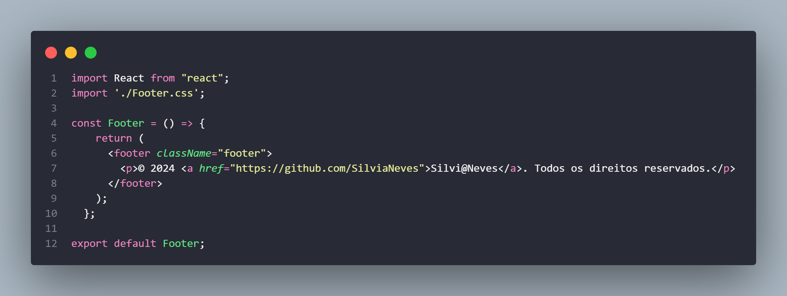

# Desafio Final

Criação de um `e-commerce` uma página web simples utilizando React e 
consumindo uma API de pesquisa e categorização dos itens (Mercado Livre), 
componentização e hooks (useState, useEffect), para exibição dos dados  em 
uma interface amigável. A aplicação constitui em realizar uma requisição GET 
ao carregar a página tratando possíveis erros com try/catch.

## Documentação da API

https://api.mercadolibre.com/sites/MLB/categories
      

https://api.mercadolibre.com/sites/MLB/search?q=ofertas${consulta}${categorias 

https://api.mercadolibre.com/sites/MLB/search?q=ofertas

## Licença

[MIT](https://choosealicense.com/licenses/mit/)

## 🛠 Habilidades

Javascript, React, HTML, CSS...

## Processo de Aprendizado

Aprendizagem durante a  construção do projeto: 

- Requisição assincrona usando fetch;
- Tratamento de erros;
- Bloco Try/catch para capturar, informar  possíveis erros e exibição dos dados;
- Componentização;
- Hooks do React, como useState e useEffect,  para gerenciar o estado e efeitos;
- Renderização Condicional;
- Manipulação de eventos, usando a lógica da Renderização Condicional;
- Implementação do botão evento onClick, com  a funcionalidade de permitir ao usuário realizar pesquisas manualmente através de um botão;
- Estilização dos componentes utilizando arquivos CSS para melhorar a apresentação visual da página;
- Uso de boas práticas de design e tornando a experiência do usuário mais agradável;
- Implementação de um filtro na interface permitindo que o usuário filtre a pesquisa por categoria. Todas as categorias como eletrônicos, moda, casa e jardim, entre outras e exibir apenas os resultados que correspondem aos filtros escolhidos.

## Desafios  e  Superações

#### Direcionamento:

- Desafio: Não saber por onde começar ou quais recursos utilizar.

- Superação: Criar um plano de estudos, seguindo uma sequência lógica de aprendizado, começando com conceitos básicos e progredindo para tópicos mais avançados.

#### Sobrecarga de Informações:

- Desafio: Sentir-se sobrecarregada com a quantidade de informação disponível.
  
- Superação: Focar em  fonte confiável, dividir o conteúdo em partes  e dedicar tempo para a prática.

#### Desmotivação:

- Desafio: Perder a motivação e o foco ao enfrentar dificuldades e não conseguir progresso imediato.

- Superação: Definindo metas alcançáveis, comemorando pequenas vitórias diárias, e lembrando constantemente de onde comecei e dos objetivos finais a serem conquistados. O apoio da Comunidade Campinho Digital e do grupo de estudo também foram fundamentais para manter a motivação.
  
#### Falta de Prática:

- Desafio: Compreender teoricamente, mas não conseguir aplicar na prática.
- 
- Superação: Conseguir aplicar o conhecimento em projetos práticos, resolvendo problemas "reais" e participando dos desafios. A Prática constante é essencial para solidificar o aprendizado.
  
#### Problemas Técnicos:

- Desafio: Dificuldades com as ferramentas e plataformas de aprendizagem.

- Superação: Foi debruçar-me nas Documentações e tutoriais, participação dos fóruns de discussão e  nunca hesitar em pedir ajuda quando se fez necessário e tentar  familiarizar-se  com as ferramentas utilizadas.

- Esse constante processo de superações me ajudaram a transformar os desafios em oportunidades de crescimento e aprendizagem mais eficazes.

## Melhorias

Muitas melhorias devem ser implementadas no  código como:
- Refatorações;
- Melhorias de performance;
- Acessibilidade;
- Sessão de login;
- Sessão pagamento do Carrinho;
- etc;

## Contribuindo

Contribuições serão sempre bem-vindas!

Por favor, siga a conduta  do projeto.

## Feedback

Se você tiver algum feedback, por favor  deixe-me saber por meio de silvia.edunantes@gmail.com

## Silvia Neves 👋

### 🚀 Sobre mim

- Eu sou uma pessoa desenvolvedora Junior em Front-End - Campinho Digital;
- AWS RE/Start Escola da Nuvem;
- Cursando Ciências dos Dados - UFMS 2025;
- Formada em Ciências Contábeis;

## Desenvolvido por

- [Silvi@Neves]
(https://github.com/SilviaNeves)

(https://www.linkedin.com/in/silvianeves-scienses/)

## Demonstração

